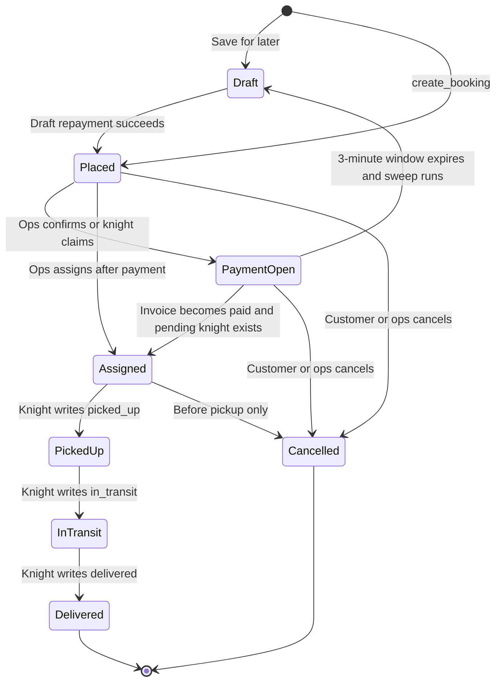
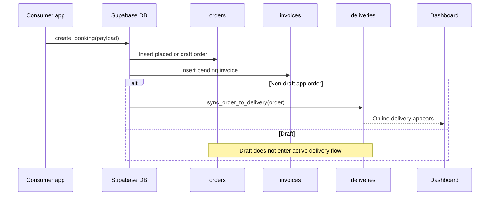
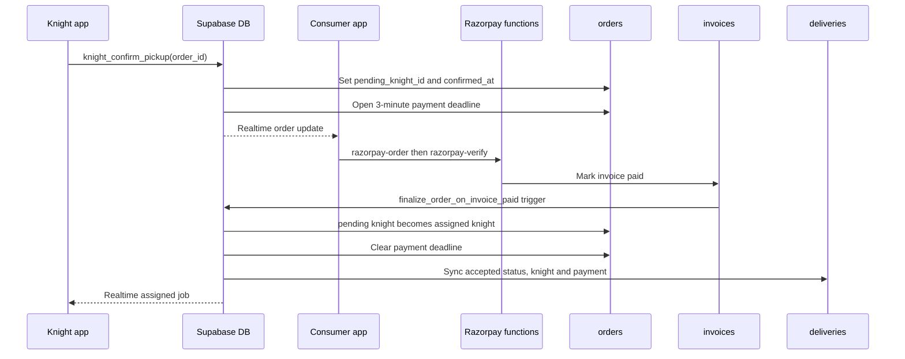

# Order lifecycle

This system has two related records:

- `orders` is the consumer/knight workflow record.
- `deliveries` is the ops/dashboard record.

**Live verified:** app-style orders sync `orders -> deliveries`. A delivery created manually in the dashboard exists only in `deliveries`; it has no `app_order_id`, never appears in the knight pool, and uses only dashboard lifecycle actions.

## State flow



Names above describe business states. The open-payment row usually has an order status in `accepted`/`confirmed`; assignment uses `assigned` or `rider_assigned`. The knight app writes the canonical execution statuses `picked_up`, `in_transit`, and `delivered`. Dashboard delivery mappings are broadly `booked`, `accepted`, `active`, `completed`, and `cancelled`.

The open knight pool is **live verified** as:

- caller profile role is `knight`;
- `assigned_knight_id` and `pending_knight_id` are both null;
- order status is `placed`, `registered`, `accepted`, or `confirmed`;
- invoice payment is `pending`.

Live policies express this through DB-only helpers `order_has_pending_invoice` and `order_is_knight_open_pool`; those helpers are missing from repository migrations.

## App booking and synchronization



**Live verified lineage:**

- `sync_order_to_delivery` matches dashboard migration `0018`: payment is invoice-derived, coordinates and distance are copied, and knight-selected walker transport/fare is synced. [Migration](../../supabase/migrations/0018_walker_transport_from_knight.sql)
- `finalize_order_on_invoice_paid` matches dashboard migration `0020`: it promotes a pending knight, clears the deadline, and synchronizes delivery payment/mode/status. [Migration](../../supabase/migrations/0020_payment_status_from_invoice.sql)
- Repository migrations in the consumer app redefine the same functions at multiple timestamps. Apply order matters; filenames alone do not prove live behavior.

## Knight claim, payment and assignment



Ops confirmation uses the dashboard lifecycle endpoint and also opens the three-minute payment phase. Ops assignment is allowed only after payment in current dashboard code. **Live verified drift:** the current `prepare_knight_assignment` is from the consumer migration lineage and reopens a three-minute payment window when assignment occurs. That behavior must be considered when changing assignment code even though the dashboard's route checks for a paid invoice first.

Zero-total/coupon orders can be auto-marked paid. For normal payments, `razorpay-order` creates the provider order and `razorpay-verify` verifies its signature before updating the invoice.

## Expiry and draft repayment

The three-minute expiry is not scheduled independently. The consumer app calls `sweep_unpaid_assigned_orders()` while loading orders. Consequently, **an expired unpaid order can linger when the consumer app is closed**.

When the sweep runs, the live behavior reverts the order to `draft`, clears assigned/pending knight and confirmation timestamps, detaches/cancels the old delivery association, and marks the draft as reverted. Draft listing similarly invokes `sweep_expired_drafts()` opportunistically.

Draft repayment:

1. Consumer completes payment.
2. `confirm_draft_payment` sets the order back to `placed`, marks the invoice paid and clears draft/expiry markers.
3. Pickup defaults to the repayment time and delivery is scheduled six hours later.
4. Normal order-to-delivery synchronization resumes.

**Live risk:** `confirm_draft_payment` writes paid/provider fields from its payload and is a weaker server-verification path than `razorpay-verify`.

Sources: [consumer booking service](../../../EYL-APP/src/services/bookingService.js), [six-hour migration](../../../EYL-APP/supabase/migrations/20260818140000_confirm_draft_starts_6h_delivery.sql), and [expiry migration](../../../EYL-APP/supabase/migrations/20260818130000_draft_reverted_marker.sql).

## Pickup through delivery

After assignment, the knight app directly updates its visible `orders` row:

1. `picked_up` when pickup starts;
2. `in_transit` when heading to drop;
3. `delivered` plus `delivered_at` when complete.

Order-to-delivery triggers map these to dashboard `active` and `completed`. Dashboard lifecycle actions can also perform pickup/deliver and push the linked order status in the other direction. [Knight source](../../../EYL-KNIGHT-APP/src/screens/orders/ActiveDeliveryScreen.js)

The live `orders_knight_update` policy is broader than these intended transitions, so these UI steps must not be interpreted as a database-enforced state machine.

## Cancellation and refunds

```mermaid
sequenceDiagram
    participant Actor as Consumer or ops
    participant DB as Supabase DB
    participant CO as cancelled_orders
    participant Q as Refund processor
    participant RF as razorpay-refund
    participant E as refund_events

    Actor->>DB: Cancel before pickup
    DB->>CO: Snapshot reason, payment and amounts
    alt Paid order
        DB->>CO: fee = round(total * 10%); refund = total - fee; status pending
        Q->>RF: Refund with cancellation idempotency key
        RF-->>Q: Refund reference
        Q->>CO: Mark refunded
        Q->>E: Log manual, auto, or cron outcome
    else Unpaid order
        DB->>CO: refund_status = none
    end
    DB->>DB: Mark order and delivery cancelled
```

Customer cancellation uses `cancel_customer_order`; dashboard cancellation implements the same hardcoded 10% paid-order fee in the HTTP lifecycle handler. Both reject cancellation after pickup. Dashboard manual refund, refund SSE automation, and API-key cron processing share the same processor and append `refund_events` for success, failure or skip. [Lifecycle route](../../app/api/deliveries/[id]/lifecycle/route.ts) and [refund processor](../../lib/server/processRefund.ts).
